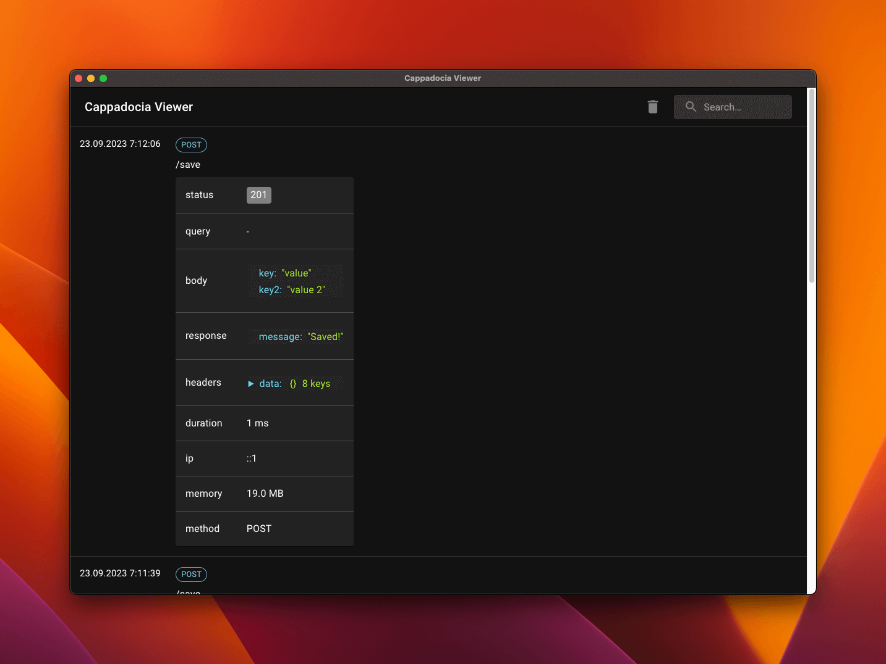

# Cappadocia Viewer for NestJS

<picture>
  
  <br/>
</picture>

Cappadocia Viewer for NestJS is a debugger used to view request and response data in NestJS applications.

# Installation

Before debugging your NestJS app, it is essential to install the Cappadocia Viewer desktop app, which allows you to debug your NestJS app. To get the Cappadocia Viewer desktop app, visit the [releases page](https://github.com/hsndmr/cappadocia-viewer/releases/tag/0.1.0)
and download the app.

After installing the Cappadocia Viewer desktop app, you can install the Cappadocia Viewer for NestJS package using npm.

```bash
npm i cappadocia-viewer-for-nestjs -D
```

You can debug requests using the `CappadociaViewerInterceptor` interceptor method.

```typescript
const app = await NestFactory.create(AppModule);

const isDevelopmentEnvironment = true;

if (isDevelopmentEnvironment) {
  const { CappadociaViewerInterceptor } = await import(
    'cappadocia-viewer-for-nestjs'
  );

  app.useGlobalInterceptors(new CappadociaViewerInterceptor());
}
await app.listen(3000);
```

After adding it, you can see requests in the Cappadocia Viewer app. Moreover, you can change the `isDevelopmentEnvironment` variable using the config value.
